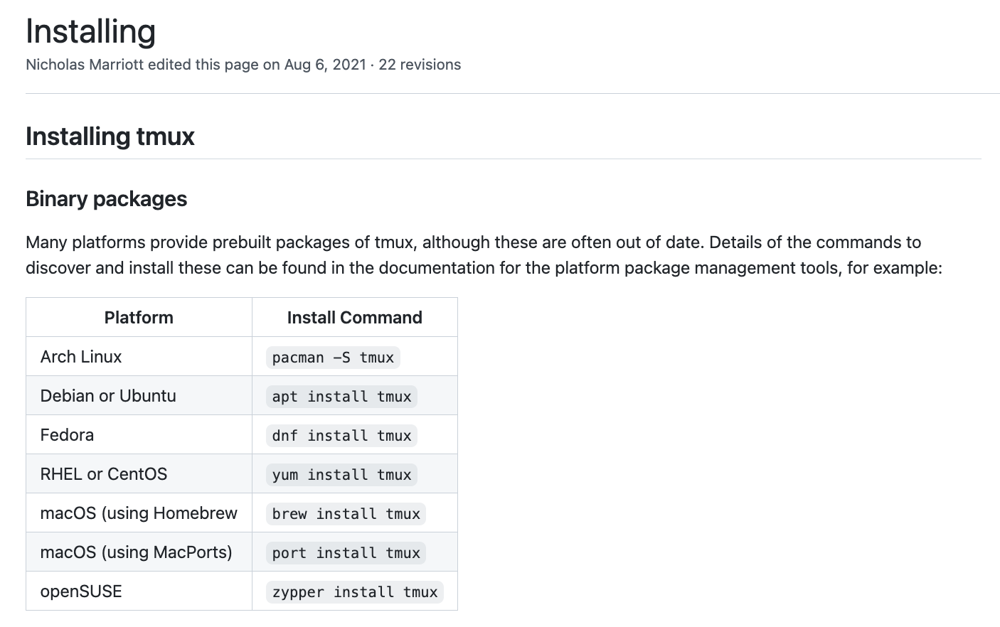

# tmux-tutorial
Tutorial Link: [Youtube](https://www.youtube.com/watch?v=8CFmwNtW8M4), [Bilibili](https://www.bilibili.com/video/BV1Mj411N7xS/)
## Installation:
</img>
image source: [here](https://github.com/tmux/tmux/wiki/Installing)

## Useful terminal commands
Feel free to set your own alias 
| Cmd | Description |
| ---- | -------- |
| man tmux | show tmux documentation  |
| tmux new -s `[Session Name]` |  create a new tmux session |
| tmux a -t `[Session Name]` |  attach to an existing session |
| tmux detach |  detach current session |
| tmux kill-session -t `[Session Name]` | Delete a specific Session  |

## My Session Shortcut
Remember to use these shortcuts <strong>inside a tmux session</strong>, not normal terminal.  
My prefix key is `Ctrl-b` or `C-b`, you can map it other keys.  
All key remappings and options setting go into `~/.tmux.conf`, remember to <strong>source this config file</strong> every time you make changes.
| Shortcut | Description |
| ---- | -------- |
| `prefix` + `:list-keys` | See all key binds, and press `q` to quit|
| `prefix` + `:show-options -g ` | See all global sessions options, and press `q` to quit|
| `prefix` + `r` | Source the `.tmux.conf` file|
| `prefix` + `$` | Rename current active session |
| `prefix` + `d` | Detach current active session |
| `prefix` + `,` | Rename current active window  |
| `prefix` + `c` | Create new window |
| `prefix` + `&` | Kill current window |
| `prefix` + `n` | Next window |
| `prefix` + `p` | Previous window |
| `prefix` + `w` | List all Sessions and windows |
| `prefix` + `\|` | Split windows left and right |
| `prefix` + `-` | Split windows up and down  |
| `Ctrl` + `h/j/k/l` | Move to the left/down/up/right pane, <strong>enabled by vim-tmux-navigator</strong>   |
| `prefix` + `h/j/k/l` | Resize pane, direction keys can be repeated  |
| `prefix` + `m` | Maximize/Unmaximize current pane  |
| `[`  | Enter copy mode  |
| `Ctrl`+`c`  | Exit copy mode|

## Plugins:
To install a plugin, add `set -g @plugin [Plugin]` in `.tmux.conf`, don't forget to initialize `tpm` at the end.
1. [Tmux Plugin Manager](https://github.com/tmux-plugins/tpm): Plugin manager tpm
2. [Vim-tmux-navigator](https://github.com/christoomey/vim-tmux-navigator):  Fast navigation among panes and (Neo)Vim
3. [Tmux-resurrect](https://github.com/tmux-plugins/tmux-resurrect): Restore tmux env after system restart
4. [Tmux-continuum](https://github.com/tmux-plugins/tmux-continuum): Continuous Saving
5. [Theme-Pack](https://github.com/jimeh/tmux-themepack): Change theme color of Tmux sessions
